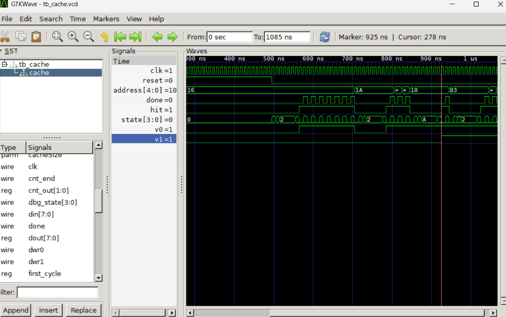

# Cache 2-Way LRU — FPGA (Gowin Tang Nano 20K)

Cache de leitura 2-Way Set-Associative com política de substituição LRU, implementada em Verilog para FPGA Gowin.

## Parâmetros

| Parâmetro     | Valor |
|---------------|-------|
| RAM           | 32 bytes (5 bits de endereço) |
| Cache         | 16 bytes, 2 vias, 2 linhas, bloco de 4 bytes |
| Tag bits      | 2 |
| Index bits    | 1 |
| Block offset  | 2 |

## Arquivos

| Arquivo | Descrição |
|---------|-----------|
| `main2way.v` | Módulo principal da cache (flat, parametrizável) |
| `top.v` | Top-level: reset, sequenciador de endereços, controle de LEDs |
| `tb_cache.v` | Testbench de validação — imprime HIT/MISS igual aos LEDs |
| `cache.cst` | Constraints de pinos para a FPGA |
| `gowin_dp/` | IP de memória dual-port gerado pelo Gowin EDA |

> Os módulos `lru.v`, `lCache.v`, `newMtag.v`, `newValid.v`, `newDatacache.v`, `newFsm.v`, `comparator.v`, `mux.v`, `encoder.v`, `ram.v`, `debounce.v` são versões modulares anteriores mantidas como referência.

## Simulação

```bash
# Compilar
iverilog -o sim.vvp tb_validacao.v top.v main2way.v

# Rodar (com SHOW_TIME=10 e OFF_TIME=5 no top.v para simulação rápida)
vvp sim.vvp
```

> **Atenção:** antes de simular, altere temporariamente no `top.v`:
> ```verilog
> localparam SHOW_TIME = 27'd10;
> localparam OFF_TIME  = 27'd5;
> ```
> Restaure para `27_000_000` / `13_500_000` antes de gravar na FPGA.

## Resultado esperado

```
idx | addr | resultado
  0 |  22  | MISS
  1 |  26  | MISS
  2 |  22  | HIT
  3 |  26  | HIT
  4 |  16  | MISS
  5 |   3  | MISS
  6 |  16  | HIT
  7 |  18  | MISS
```

## LEDs

| LED | Significado |
|-----|-------------|
| LED0 | HIT (ativo em baixo) |
| LED1 | MISS (ativo em baixo) |
| LED2 | Fim do loop (pisca) |


